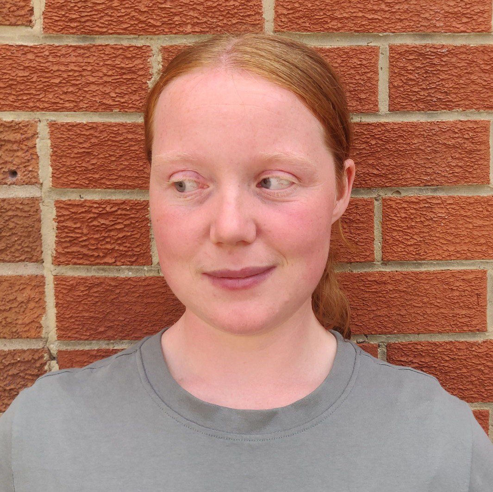

# Introductions

## Teaching Staff

:::: columns
::: column

**Dave Cobb**, Module Leader.

::: cell-output-display
{fig-align="center"
fig-alt="Staff photo of Dave cobb" width="60%"}
:::

::: {.column}
25 years experience in the computer industry. Subject leader, senior lecturer specialising in softare development. 
:::
:::
::: column

**Hollie Baker**, Associate Lecturer

::: cell-output-display
{fig-align="center"
fig-alt="Staff photo of Hollie Baker" width="60%"}
:::

::: {.smaller}
PhD in computer science. Worked at a local company building web-based patient management systems and databases. Currently developing software for Bristol Braille Technology. Braillist.
:::
:::
::::

# Module Overview

## Intended Learning Outcomes

## Topics covered

## Schedule

## Timetable

# Assessment

