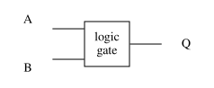
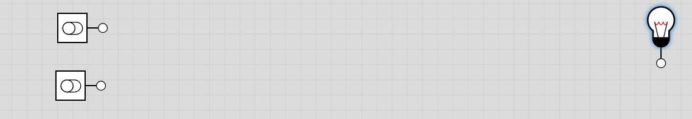
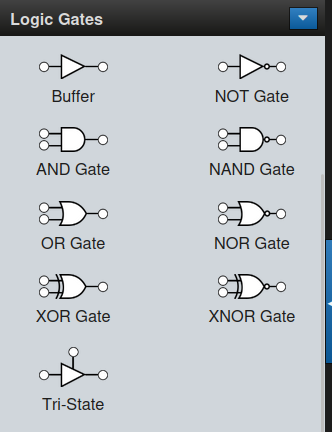

## Learning Outcomes

- Draw logic gates and define them using truth tables
- Combine logic gates to create different outputs.

# Logic gates

## Boolean Algebra

- Variant of Aristottle's Propositional Logic proposed by George Boole 1854.
- **Variables** can be `true` $1$ or `false` $0$
- Logical operations performed on variables to produce an output.
- Used to build digital circuits.

## Logic gates and truth tables

::::::: columns
::::: column
We can represent a Boolean logical operator as a **logic gate**

:::: {.cell layout-align="center"}
::: cell-output-display
{fig-align="center"
fig-alt="A generic logic gate with two inputs." width="60%"}
:::
::::

- One or more inputs.
- One output determined by input values.
:::::

::: column
Defined by a **truth table**.

| $A$ | $B$ | $Q = A \ast B$ |
|:---:|:---:|:--------------:|
| $1$ | $1$ | ?              |
| $1$ | $0$ | ?              |
| $0$ | $1$ | ?              |
| $0$ | $0$ | ?              |
:::
:::::::

::: notes
Logic gate is a "black box" (a thing that takes in inputs, does something with it, and gives you an output), truth table is its lookup table. 
:::

## Physical Computing...

<iframe width="697" height="837" src="https://www.youtube.com/embed/z2Frzt_hkQY" title="The world&#39;s first human-powered computer.  ||  3 body problem#3bodyproblem #shorts #viral #edit" frameborder="0" allow="encrypted-media; picture-in-picture; web-share" referrerpolicy="strict-origin-when-cross-origin" allowfullscreen></iframe>

## AND

Output $Q$ is *True* only when **both** inputs $A$ and $B$ are *True*.

::::::: columns
::: column
Defining Truth Table:

| $A$ | $B$ | $Q = A\ \mathrm{AND}\ B$ |
|:---:|:---:|:------------------------:|
| $1$ | $1$ |           $1$            |
| $1$ | $0$ |           $0$            |
| $0$ | $1$ |           $0$            |
| $0$ | $0$ |           $0$            |

:::
::: column

Logic gate:

:::: {.cell layout-align="center"}
::: cell-output-display
{fig-align="center"
fig-alt="An AND gate. Flat at the back." width="80%"}
:::
::::
:::
::::::

::: notes
When building circuit diagrams, it is convenient to use symbols to
represent logic gates. Here we depict the ANSI symbols (other symbels,
e.g., IEC and DIN are also available, but ANSI seems to be the most
widely used).
:::

## AND: example

:::: {.cell layout-align="center"}
::: cell-output-display
{fig-align="center"
fig-alt="Two people pulling switches simultaneously to activate a nuclear weapon." width="80%"}
:::
::::

## OR

Output $Q$ is *True* only when **either** (or both) inputs $A$ or $B$
are *True*.

::::: columns
::: column
Defining Truth Table:

| $A$ | $B$ | $Q = A\ \mathrm{OR}\ B$ |
|:---:|:---:|:-----------------------:|
| $1$ | $1$ |           $1$           |
| $1$ | $0$ |           $1$           |
| $0$ | $1$ |           $1$           |
| $0$ | $0$ |           $0$           |

:::
::: column
Logic gate:

:::: {.cell layout-align="center"}
::: cell-output-display
{fig-align="center" fig-alt="An OR gate. Curved at the back."
width="80%"}
:::
::::
:::
:::::

::: notes
Note that this is different from the way we use "or" in everyday
language. When a parent asks a child if they want chocolate "or" clrsps,
they mean for the child to choose one of the other, not both. However,
logical or would allow chocolate, crisps or both chocolate and crisps.
:::

## OR: example

:::: {.cell layout-align="center"}
::: cell-output-display
{fig-align="center"
fig-alt="Lightning striking a building.." width="80%"}
:::
::::

::: notes
Hospital power OK if main power working, backup power working, or both.
:::

## XOR

Output $Q$ is *True* only when **either** inputs $A$ and $B$ are *True*,
but **not both**.

::::: columns
Defining Truth Table:

::: column
| $A$ | $B$ | $Q = A\ \mathrm{XOR}\ B$ |
|:---:|:---:|:------------------------:|
| $1$ | $1$ |           $0$            |
| $1$ | $0$ |           $1$            |
| $0$ | $1$ |           $1$            |
| $0$ | $0$ |           $0$            |
:::
::: column
Logic gate:

:::: {.cell layout-align="center"}
::: cell-output-display
{fig-align="center"
fig-alt="An XOR gate. Double line curved back." width="80%"}
:::
::::
:::
:::::

::: notes
XOR or exclusive or is true if either input is true, but not both, as in
the use of "or" in daily life.
:::

## XOR: example

:::: {.cell layout-align="center"}
::: cell-output-display
{fig-align="center"
fig-alt="Enigma machine." width="80%"}
:::
::::

## NOT

One input; output $Q$ is *True* only when inputs $A$ is *False*.

::::: columns
Defining Truth Table:

::: column
| $A$ | $Q = \mathrm{NOT}\ A$ |
|:---:|:---------------------:|
| $1$ |          $0$          |
| $0$ |          $1$          |

:::
::: column
Logic gate:

:::: {.cell layout-align="center"}
::: cell-output-display
{fig-align="center" fig-alt="A NOT gate. Forward pointing triangle with a small circle on the end."
width="80%"}
:::
::::
:::
:::::

## NOT: example

:::: {.cell layout-align="center"}
::: cell-output-display
{fig-align="center"
fig-alt="Car headlights lit in the dark" width="80%"}
:::
::::

## NAND

Output $Q$ is *True* only when **either** (or both) inputs $A$ and $B$
are *False*.

::::: columns
::: column
Defining Truth Table:

| $A$ | $B$ | $Q = A\ \mathrm{NAND}\ B$ |
|:---:|:---:|:-------------------------:|
| $1$ | $1$ |            $0$            |
| $1$ | $0$ |            $1$            |
| $0$ | $1$ |            $1$            |
| $0$ | $0$ |            $1$            |

:::
::: column
Logic gate:

:::: {.cell layout-align="center"}
::: cell-output-display
{fig-align="center"
fig-alt="A NAND gate.. Same symbol as AND, with small circle at the end." width="80%"}
:::
::::
:::
:::::

## NAND: example

:::: {.cell layout-align="center"}
::: cell-output-display
{fig-align="center"
fig-alt="Burglar alarm." width="80%"}
:::
::::

## NOR

Output $Q$ is *True* only when \*both\*\* inputs $A$ and $B$ are
*False*.

::::: columns
::: column
Defining Truth Table:

| $A$ | $B$ | $Q = A\ \mathrm{NAND}\ B$ |
|:---:|:---:|:-------------------------:|
| $1$ | $1$ |            $0$            |
| $1$ | $0$ |            $0$            |
| $0$ | $1$ |            $0$            |
| $0$ | $0$ |            $1$            |

:::
::: column

Logic gate:

:::: {.cell layout-align="center"}
::: cell-output-display
{fig-align="center" fig-alt="A NOR gate. Same symbol as OR with small circle to right."
width="80%"}
:::
::::
:::
:::::

## NOR: example

:::: {.cell layout-align="center"}
::: cell-output-display
{fig-align="center"
fig-alt="Nuclear power plant." width="80%"}
:::
::::

::: notes
- Detects Xenon buildup in each reactor in the nuclear power plant.
- If **ANY** reactor registers True (unsafe condition) the safety system activates.
- All cores are shutdown safely.
- Power station running if *NONE* of the cores are unsafe.
:::

## Exercise: logic gate simulator

::::::: columns
::: column
:::: {.cell layout-align="center"}
::: cell-output-display
{fig-align="center"
fig-alt="Logic.ly simulator showing two toggle switches and a light bulb."
width="90%"}
:::
::::

- Go to [https://logic.ly/demo](https://logic.ly/demo/).
- Add two *Toggle Switches* as inputs and one *Light Bulb* as the
  output.

:::
::: column
:::: {.cell layout-align="center"}
::: cell-output-display
{fig-align="center"
fig-alt="Logic.ly simulator, logic gates in left-hand panel."
width="60%"}
:::
::::
:::
:::::::

## Exercise: One gate in terms of another {.activity}

Build the following:

- an **AND** gate using only **NOT** and **OR**;
- an **OR** using only **NOT** and **AND**;
- a **NOT** gate using only **NAND**;
- an **AND** gate using only **NAND**;
- an **OR** gate using only **NAND**;
- **NOT**, **AND** and **OR** gates using only **NOR**.

::: notes
Use the simulator, do it on paper, of if hardware is available, could
even build real circuits.
:::

## Universal logic gates

- A **universal** logic gate (or logical operator) can be used to
  represent **any** other logical operator.

- Which of the logical operators **AND**, **OR**, **NAND** and **NOR**
  are universal?

## Universal logic gates Solution

- **NAND** and **NOR**

# Next Time

Building components with logic gates
