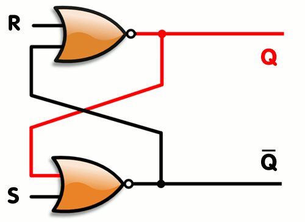
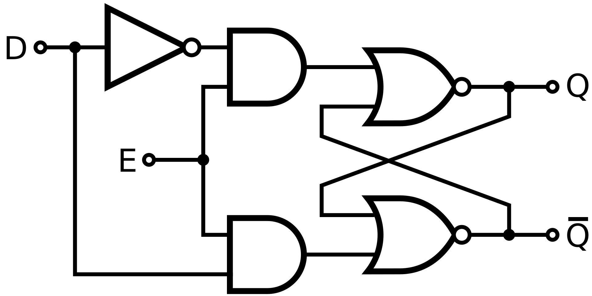
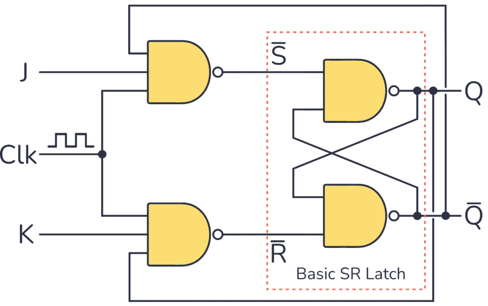
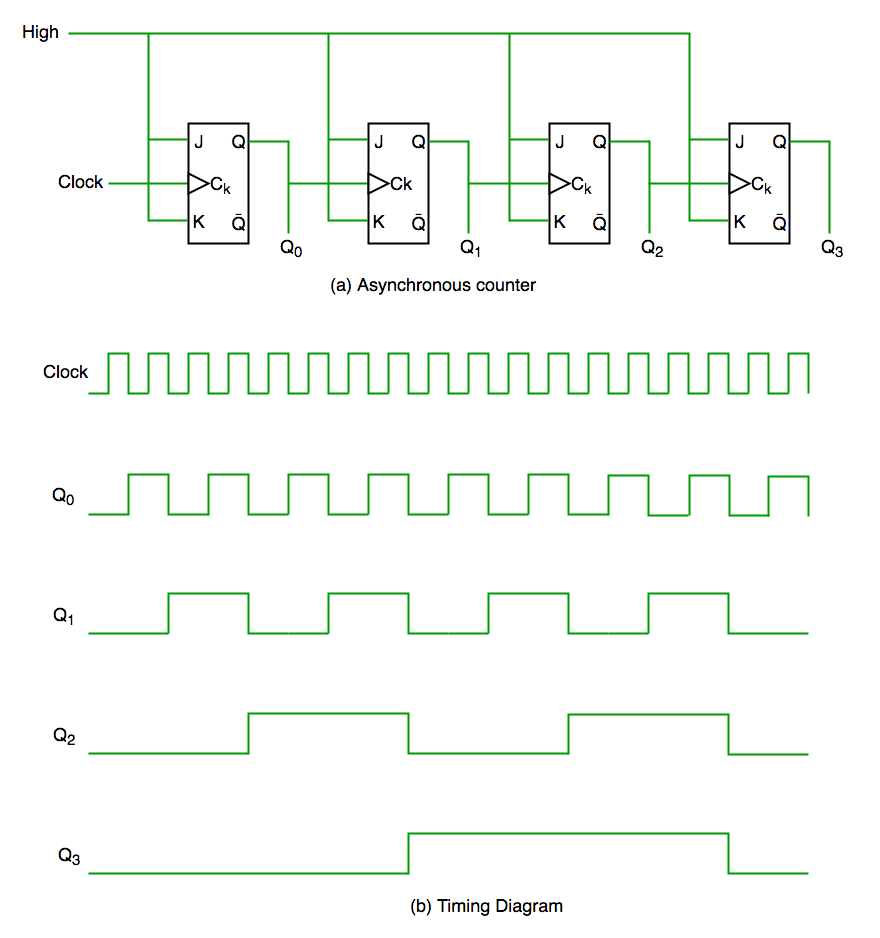

## Learning Outcomes

- Explain why we need latches, and how flip-flops differ from latches.
- Recognise various types of latch.
- Build a counter out of logic gates..

## Latches

## Latches

- Component which "remembers" a value until it is changed by a new
  signal.
- Can be used to store $1$ bit of data.
- Widely used in digital circuits, e.g., for data storage, control and
  flip-flop circuits.

## SR-latch

::::: columns
::: column
- **Set-reset** latches are the simplest type of latch.
- Can be constructed from two *NOR* gates.
- Two inputs, $S$ (set) and $R$ (reset). State is changed when a *pulse*
  (high voltage, or $1$) is applied to $S$ or $R$.
- The output is $Q$ and its inverse is $\overline{Q}$.

:::
::: column
:::: {.cell layout-align="center"}
::: cell-output-display
{fig-align="center"
fig-alt="Animation of an sr-latch." width="90%"}
:::
::::
:::
:::::

## SR-latch

::::: columns
::: column
:::: {.cell layout-align="center"}
::: cell-output-display
{fig-align="center"
fig-alt="Animation of an sr-latch." width="95%"}
:::
::::
- Initial state: no voltage to $S$ or $R$.

:::
::: column
- $Q$ shows $1$, its inverse, $\overline{Q}$ shows $0$.

- To **reset**, apply a pulse to $R$.

  $Q$ set to $0$ and $\overline{Q}$ set to $1$.

- To **set** the latch, apply a pulse to $S$.

  $Q$ is set $1$ and $\overline{Q}$ set to $0$.

- Applying a pulse to both $Q$ and $R$ is not valid.
:::
:::::

## Exercise: SR-latch with NAND gates

- Can you build a SR-latch using two NAND gates?

## Solution: SR-latch with NAND gates

:::::: columns
::: column
:::: {.cell layout-align="center"}
::: cell-output-display
{fig-align="center"
fig-alt="SR latch built with NAND gates." width="95%"}
:::
::::
:::
::: column
- A high voltage needs to be applied to both $\overline{S}$ and
  $\overline{R}$.

- A pulse of **low voltage** will cause the state to change.

- It is called an **active low SR-latch**.
:::
::::::

## Gated SR latch

::::: columns
::: column
- We may only want the state to change if the latch is *enabled*.

- This can be done by building a **gated** latch.

- Recall that an *AND* gate is only true when both inputs are true.

- So we add *AND* gates, creating another input, $E$.

:::
::: column

- The state can only change if $E$ has a high voltage applied to it.

:::: {.cell layout-align="center"}
::: cell-output-display
{fig-align="center"
fig-alt="Gated SR-latch, the NOR SR-latch with and gates added to the left."
width="95%"}
:::
::::
:::
:::::

## Exercise: gated SR-latch with NAND gates

- How could you convert your NAND gate SR-latch to make it gated?

## Solution: gated SR-latch with NAND gates

::::: columns
::: column
:::: {.cell layout-align="center"}
::: cell-output-display
{fig-align="center"
fig-alt="Gated SR-latch, the NAND SR-latch with NAND gates added to the left."
width="95%"}
:::
::::
:::
:::column
- Connect a *NAND* gate to the inputs $\overline{S}$ and $\overline{R}$,
  we get $S$, $R$ and the *enabling* input $E$.
:::
:::::

## Application: switch bounce

- Latches are widely used in electrical engineering as well as
  electronic computers.

- When a mechanical switch is pressed, it may cause several pulses to be
  sent.

  An SR-latch ensures that only one signal is sent, since subsequent
  pulses to $S$ or $R$ will not cause a change in state.

  - A gated latch can be used when state should only be changed when a
    device is *Enabled*.

::: notes
E.g., an air conditioning unit may switch cooling on and off
depending on input from a temperature sensor, but the unit should
only switch on cooling if it has been turned on by the user.
:::

## D-latch

::::: columns
::: column
- **0Data** or **transparent** latches have two inputs: *Data* ($D$) and
  *Enable* ($E$).

- The state changes to the value of $D$ only when $E$ signal is high.

- When the *Enable* signal is low, the value of $D$ is stored until the
  leading edge of the next rising *Enable* Signal.

:::
::: column

- A D-latch can be built from a gated SR-latch.

:::: {.cell layout-align="center"}
::: cell-output-display
{fig-align="center" fig-alt="D-latch."
width="95%"}
:::
::::
:::
:::::

## D-latch

::::::::: columns
- Built by connecting the $S$ and $R$ inputs of an SR-latch.

:::: {.cell layout-align="center"}
::: cell-output-display
{fig-align="center" fig-alt="D-latch."
width="95%"}
:::
::::
:::::::::

## D-latch (Alternative)

- It can also be built from the NAND SR-latch.

:::: {.cell layout-align="center"}
::: cell-output-display
{fig-align="center"
fig-alt="D-latch build from nand gates." width="95%"}
:::
::::

- This version is made from **only** *NAND* gates.

# Flip-Flops

## Flip-flops

- Latches are inexpensive and easy to implement using simple logic
  components.

- However, their behaviour can be unpredictable owing to a lack of
  synchronisation.

- Flip-flops add a **clack** to synchronise their operaton.

- A gated latch can be converted into a flip-flop by connecting a
  **clock** to the *Enable* input.

## JK Flip-flops

::::: columns
::: column
- **Reset**: high pulse to $K$.
- **Set**: high pulse to $J$.

- If a high pulse is sent to **both** $J$ and $K$, then the state is
  *toggled*.

  I.e., $0$ becomes $1$ and $1$ becomes $0$.

:::
::: column
:::: {.cell layout-align="center"}
::: cell-output-display
{fig-align="center" fig-alt="JK flip-flop."
width="95%"}
:::
::::

We will use this latch shortly to build a *counter*.
:::
:::::

## Counting in binary

- We saw that digital circuits have two possible values: *low* (or $0$)
  and *high* (or $1$).

- Everything (letters, images, sounds, programs) in a computer is
  represented by a number.

- Numbers are encoded in **binary** using a certain number of *binary
  digits* (bits).

- A whole (integer) number is typically represented using $8$ bits (a
  byte).

  E.g., for unsigned ($\ge 0$) integers, $0 = 00000000$,
  $37 = 00100101$.

## Building a counter

We can build a counter, using JK flip-flops, which increments an integer
represented by $4$ bits (half a byte; a nibble).

- Start by adding one *Push button* as input and one *4-bit digit* as
  the output.

- The counter should start at $0$ and increase by $1$ each time the
  button is pushed.

## Building a Counter 2

:::: {.cell layout-align="center"}
::: cell-output-display
{fig-align="center"
fig-alt="JK flip-flop counter and timing diagram." width="55%"}
:::
::::

::: notes
The timing diagram shows how the values of $Q_0,\ldots,Q_3$ should change.
:::

## Exercise: build the counter {.smaller}

1. Add one *toggle switch*, this will act as the clock.
2. Add a *High* voltage.
3. Add one *$4$-bit digit*, this will display the output.
4. Add four JK flip flops and connect high voltage to $J$ and $K$ on all
  of them.
5. connect the button (clock) to the *Clock* input of the first
  flip-flop.
6. The output of the first flip-flop is $Q_0$, the final digit. connect
  this to the $4$-bit digit and to the *Clock* input on the next
  flip-flop.
7. repeat with the remaining 3 flip-flops.

# Next time

Computer architecture overview
