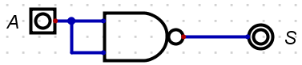
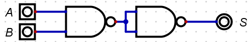
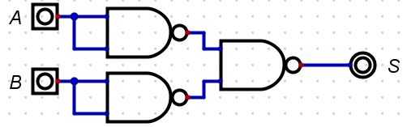
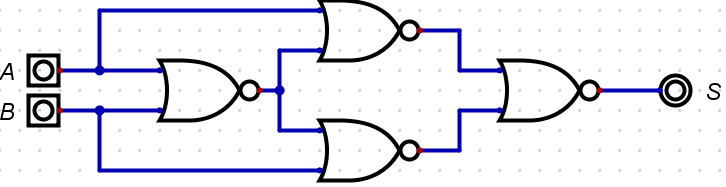
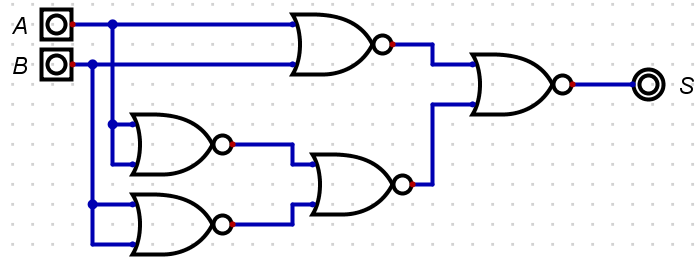
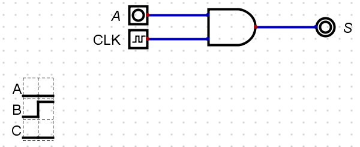
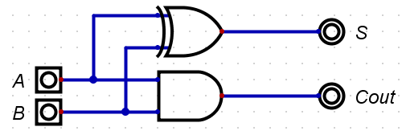

Adapted from [https://cccu-uk.github.io/U10793_FCC_Labs/Logic_Gates/Logic_Gates.html](https://cccu-uk.github.io/U10793_FCC_Labs/Logic_Gates/Logic_Gates.html)

## Universal Logic Circuits

We can build any of the fundamental logic gates by chaining **only nand** or **only nor** gates together.

**Question 1** Create the circuit as shown below. 

{fig-align="center"
fig-alt="" width="50%"}

Draw its truth table. Which logic gate does it represent?

**Question 2** By experimenting with the circuit and constructing a truth table, identify which logic gate the following circuit represents.

{fig-align="center"
fig-alt="" width="50%"}

**Question 3** By experimenting with the circuit and constructing a truth table, identify which logic gate the following circuit represents.

{fig-align="center"
fig-alt="" width="50%"}

**Question 4** By experimenting with the circuit and constructing a truth table, identify which logic gate the following circuit represents.

{fig-align="center"
fig-alt="" width="50%"}

**Question 5** By experimenting with the circuit and constructing a truth table, identify which logic gate the following circuit represents.

{fig-align="center"
fig-alt="" width="50%"}

**Question 6** By experimenting with the circuit and constructing a truth table, identify which logic gate the following circuit represents.

{fig-align="center"
fig-alt="" width="50%"}

## The Clock

Use the clock to geterate signals.

Create the circuit as shown below:

{fig-align="center"
fig-alt="" width="50%"}

Connecting the clock as input and adding the data graph. 

- Experiment with different Clock Input Frequencies, what observations can you make? Discuss with the a peer or with the tutor.
- Replace the or gate with a different gate, change the frequency. 
- Does the data graph show a pattern?

## Half Adder

Recreate the half adder circuit as shown below.
{fig-align="center"
fig-alt="" width="50%"}

Use the simulator to complete the truth table

| A  | B  | S  | Cout |
|:--:|:--:|:--:|:----:|
| 1  | 1  |    |      |
| 1  | 0  |    |      |
| 0  | 1  |    |      |
| 0  | 0  |    |      |

## Full adder

Now produce a *full adder*, simulate and complete the truth table.

| A  | B  | Cin | S  | Cout |
|:--:|:--:|:---:|:--:|:----:|
| 1  | 1  | 1   |    |      |
| 1  | 1  | 0   |    |      |
| 1  | 0  | 1   |    |      |
| 1  | 0  | 0   |    |      |
| 1  | 1  | 1   |    |      |
| 0  | 1  | 0   |    |      |
| 0  | 0  | 1   |    |      |
| 0  | 0  | 0   |    |      |

## Binary Decoder

Research and implement a 2-bit binary decoder. 

A binary decoder takes $n$ bits as input and can output one of $2^n$ possible options, depending on the value of the input.
For example, in a 2-bit decoder, there are four possible outputs, each corresponding to one of the possible assignments of bits:

- $00$
- $01$
- $10$
- $11$
