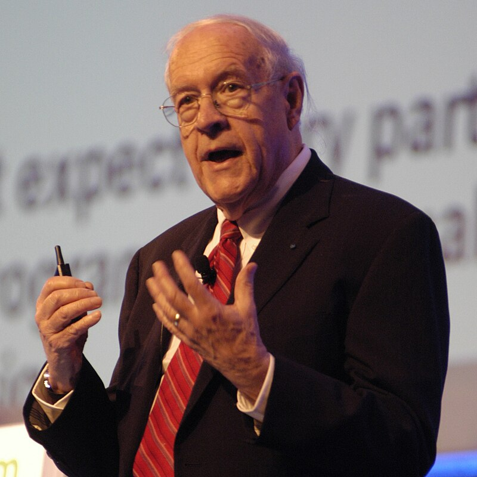
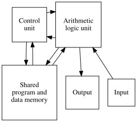
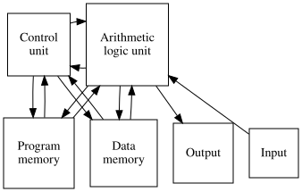
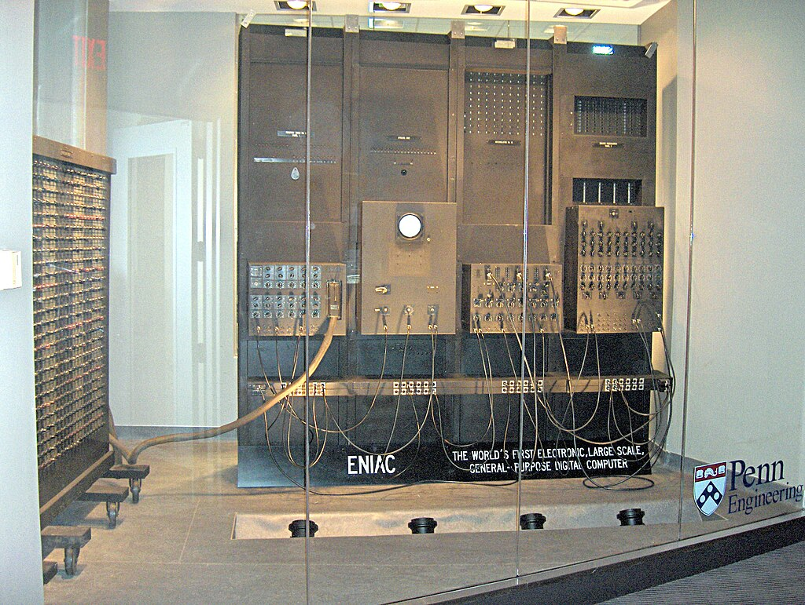
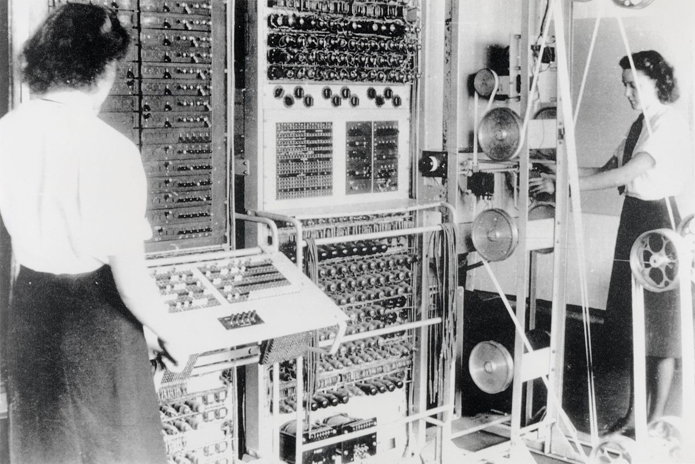
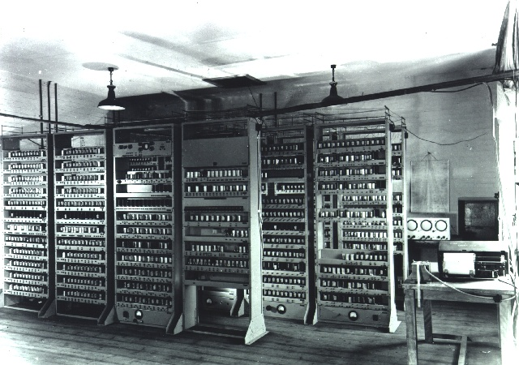

## Learning Outcomes

- State the five components of a Von Neumann computer.
- Describe the difference between the Von Neumann and Harvard architecture.
- Explain the advantages and disadvantages of the Von Neumann vs Harvard architectures.
- Argue for the "best" architecture in a given situation.

## Architecture

::::: columns
::: column
:::: {.cell layout-align="center"}
::: cell-output-display
{fig-align="center" fig-alt="Photograph of Brooks" width="80%"}
:::
::::
:::
::: column

"Computer architecture, like other architecture, is the art of determining the needs of the user of a structure and then designing to meet those needs as effectively as possible within economic and technological constraints."

-- Frederick P. Brooks

:::
:::::

::: notes
Brooks was an American computer architect, software engineer and computer scientist who managed IBM 360 series of mainframes and their accompanying software.
:::

## Computer Architecture

- A description of a computer (or computer system) which is made from component parts.

- Often a high-level description, indicating how components are linked and what each does.

- Sometimes includes details such as the *instruction set* used and other implementation details.

## Computer Architecture

- 1837: First documented computer architecture was in correspondence between Charles Babbage and Ada Lovelace, where Babbage described his analytical engine.

- 1890: Herman electromechanical tabulating machine used to analyse census data stored on punched cards.

- 1936, Conrad Zeus described a computer where both instructions and data are stored in the same memory: First documented instance of a "stored program" or general purpose computer.

## Computer Architecture

- 1945, John Von Neumann described the famous Von Neumann Architecture in his paper on the EDVAC computer (successor to the ENIAC).

## Computer Architecture

- 1946, Alan Turing wrote a detailed proposal for the electronic calculator, Automatic Computing Engine, citing Von Neumann.

# Von Neumann vs Harvard

## Von Neumann Architecture

:::: {.cell layout-align="center"}
::: cell-output-display
{fig-align="center" fig-alt="diagram of Von Neumann architecture showing five components described on the next page" width="60%"}
:::
::::

::: notes
Arrows represent data transfer connections and directions. I.e., there is an arrow in both directions between the memory and the arithmetic logic unit, representing a "shared bus". We will see later that this shared bus can be a bottleneck.
:::

## Five components

- Store
- Control Unit
- Arithmetic Logic Unit
- input
- Output

## Store

- To store data and instructions. E.g., paper tape, magnetic tape, RAM.

## Control Unit

- decides which instruction to perform next.

## Arithmetic Logic Unit

- Performs calculations.
  - Typically the ALU and control unit are combined into the CPU.
  - Operations performed on the hardware, or implemented in software.
  - In early computers, electromechanical hardware was used; these days transistors are used, which require much less energy.

## Input and Output

- Means for the user to interact with the computer.
  - Keyboard, mouse, camera, sensors.
  - Monitor, speakers.
  - Varied and interesting ways for humans and computers to interact.

## Key features

- Instructions and data are stored in the same memory.

- Simple, cost-effective and widely used.

::: notes

- Single bus to transfer all data.
- This can cause a bottleneck.
- Sequential architecture Can limit speed of processing. : CPU can perform only one instruction at a time.
- This is the architecture found in most desktop PCs today.
:::

## Harvard Architecture

:::: {.cell layout-align="center"}
::: cell-output-display
{fig-align="center" fig-alt="diagram of Harvard architecture showing the same components as Von Neumann, but with separate memory and separate buses for instructions and data" width="60%"}
:::
::::

## Harvard Architecture

- Has **separate** memory for instructions and data.

- Well suited to embedded systems and main-frames.

::: notes
- Reduces the memory bottleneck found in Von Neumann machines.
  - Less contention as there is no shared bus.
  - Data and instruction access can be done simultaneously.
  - Less flexible than Von-Neumann. E.g., instructions cannot be modified at run-time.
:::

# Discussion

## In small groups

- In which situations is each architecture used?
  - Today and historically?
  - Why is it a good choice for that situation, or why not?

- Things to think about:
  - where are the bottlenecks?
  - special purpose vs general purpose
  - data integrity / tampering / security

# Before the era of personal computers

## 1949

> "The"brain" \[computer\] may one day come down to our level \[of the common people\] and help with our income-tax and book-keeping calculations. But this is speculation and there is no sign of it so far."

-- British newspaper The Star in a June 1949 news article about the EDSAC computer.

## 1953

> "I think there is a world market for maybe five computers."

-- Thomas Watson, IBM Chairman, although this is now thought to be urban legend.

::: notes
The "brain" computer has now very much "come down to the level of the common people", and does much more than just book-keeping.

Regarding the Watson quote, it is now thought to be an urban legend. see https://geekhistory.com/content/urban-legend-i-think-there-world-market-maybe-five-computers

“We believe the statement that you attribute to Thomas Watson is a misunderstanding of remarks made at IBM’s annual stockholders meeting on April 28, 1953. In referring specifically and only to the IBM 701 Electronic Data Processing Machine – which had been introduced the year before as the company’s first production computer designed for scientific calculations – Thomas Watson, Jr., told stockholders that “IBM had developed a paper plan for such a machine and took this paper plan across the country to some 20 concerns that we thought could use such a machine. I would like to tell you that the machine rents for between $12,000 and $18,000 a month, so it was not the type of thing that could be sold from place to place. But, as a result of our trip, on which we expected to get orders for five machines, we came home with orders for 18.”
https://geekhistory.com/content/urban-legend-i-think-there-world-market-maybe-five-computers
:::

## Learning Outcomes

- Give an overview of early computers: use, specs, how they were programmed.
- Compare early and modern computers
- Explain how developments in early computing have influenced modern computer hardware.

# Representing numbers

## Integers

- We already saw that an **unsigned integer** number can be represented
  in Binary.

- Usually the right-most bit represents the least significant digit.

  **Little-endian** representation.

- **Signed** integers may be represented in several ways:

  - *Sign+magnitude*: one bit is reserved for the sign, the rest for the
    value.

    This representation allows $+0$ and $-0$.

  - *One's complement*: positive numbers represented as usual, negative
    numbers represented by flipping all their bits.

    Again, we have $+0$ and $-0$.

  - *Two's complement*: positive numbers represented as usual, negative
    numbers represented by adding one then flipping all their bits.

    only one $0$, no redundancy.

## Floating point numbers

- IEEE 754 defines a standard for representing and manipulating floating
  point numbers.

- Represented in a similar way to **scientific notation**.

  E.g., $300,000,000 = 3 \times 10^8$.

  - The $3$ is called the **fraction** (coefficient or mantissa).
  - The $8$ (from $10^8$) is called the **exponent**.

- IEEE 754 defines:

  - The **base**, typically $2$ for binary, but sometimes $10$.
  - Precision (number of digits to represent the fraction).
  - An exponent range.

## Floating point numbers

- Using $n$ bits, the representation consists of

  - $1$ bit for the **sign**,
  - $n - p - 1$ bits for the **exponent**.
  - $p$ bits for the **fraction** (stored in Binary),

- **Any signed number** up to $p$ significant digits and a maximum
  exponent of $n-p-1$ can be defined.

- Positive and negative **infinity**.

- A representation for **not a number**, e.g., for the result of
  division by zero.

## 32-bit floating point

Representation used for the `float` type in many programming languages.

:::: {.cell fig.caption="center"}
::: cell-output-display
{fig-alt="representation of a floating point number with ISO 754"
width="90%"}
:::
::::

- $32$ bits:

  - $1$ bit for the sign,
  - $8$ bits for the exponent,
  - $23$ bits for the fraction.

- Around $7$ decimal digits for the fraction.

- A `double` uses $64$ bits, $52$ bits (around $16$ decimal digits).

## Floating point numbers

### Advantages

- Efficient representation of very large and very small numbers.

- Fast computation due to many years of hardware development.

### Disadvantages

- Floating point errors.

## Precision and accuracy

- **Precision**: how many significant digits,
- **Accuracy**: how close to the true value.

A value may be precise but *not accurate*, accurate but *not precise*,
or both inaccurate and imprecise.

## Floating point errors

- We know that $1/3 + 1/3 + 1/3 = 1$.

  However, $0.3333333333 + 0.3333333333 + 0.3333333333 = 0.9999999999$!

- $1/10$ is easy to represent in decimal: $0.1$.

  However, in binary, it is $0.001100110011$.

- Floating point representation is sufficient for most applications,
  e.g., 3D games.

  However, we have to take care with things like currency, which must be
  correct.

# History 

## But first, why are we doing this?

- Gain perspective.
- Understanding of why things are the way they are today.
- Learn from previous successes and failures.

# Early computers

## The ENIAC (1945)

::::: columns
::: column

**Electronic Numerical Integrator and Computer**

- Special purpose computer for artillery firing table calculations.

- Located at the School of Engineering and Applied Science, Pennsylvania State University
:::
::: column
:::: {.cell layout-align="center"}
::: cell-output-display
{fig-align="center" fig-alt="ENIAC" width="70%"}
:::
:::
::::
:::::

::: notes
- Could be "programmed" by using the plug-board and switches, data entered via punched cards.

- Later converted into a stored program computer.

- Base-10 arithmetic instead of the usual binary.

- Used vacuum tubes, which burnt out often -- high maintenance.
:::

## Colossus (1943-45)

::::: columns
::: column
:::: {.cell layout-align="center"}
::: cell-output-display
{fig-align="center" fig-alt="Colossus" width="70%"}
:::
::::
:::
::: column

- Special purpose computer developed at Bletchley Park to help break the Lorenz cipher.
- Designed by Tommy Flowers, a research engineer at the General Post Office, based on plans by Code and Cipher School mathematician Max Newman.

:::
:::::

::: notes

- Used vacuum tubes; programmed using switches and a plug board.
- Data memory was a cycling strip of paper tape.
- Colossus Mk II, which used shift registers to run 6 times faster, went into operation in time for the D-day landings.
- By the end of the war, 10 Colossi were in operation.

:::

## General purpose computers (post WW2)

Von Neumann arranged a 6-week summer workshop to design and build a new type of computer.

- **General purpose**: many early computers were designed with a specific task in mind, which meant they were difficult to repurpose.

  Von Neumann wanted to build a stored program computer.

- **Electronic**:replacing electromechanical components which were brittle, hot and noisy.

  Colossus and the ENIAC both consumed **150KW** of power.

- **Use binary**, which is the easiest encoding to work with when using electronic components.

## Maurice Wilkes

- Cambridge mathematician, physics PhD on "radio propagation of very long radio waves in the ionosphere".

- Attended Jon Neumann's workshop, then returned to Cambridge to build the EDSAC machine.

- Worked in radar during WW2, which inspired the memory technology for EDSAC.

- Memory was a limitation for early electronic computers, Wilkes used "delay lines", mercury tubes and an oscilloscope, as memory.

::: notes
More information on mercury delay lines: Radar pulses were captured and played as sound waves. Sound waves passed through mercury, which slowed them down. Picked up by a microphone and displayed no an oscilloscope screen. Sound wave amplified and played back through the speaker so the pulse would repeat as long as needed.
:::

## EDSAC (6 May 1949)

::::: columns
::: column

**Electronic Delay Storage Automatic Calculator**

- One of the first **stored program computers** which used **binary**.

- Developed by Maurice Wilkes, William Renwick (hardware engineer) and David Wheeler (first system software engineer).

:::
::: column
:::: {.cell layout-align="center"}
::: cell-output-display
{fig-align="center" fig-alt="EDSAC" width="70%"}
:::
::::
:::
:::::

::: notes
- Could perform 700 additions or 200 multiplications per second.
- 512 18-bit words of memory for programs and data, upgraded to 1024 18-bit words in 1952.
- Data **and programs** were loaded via 5-hole punched paper tape, *initial orders* instructed the computer to load the program.
- Consumed **11KW** of power.
- The delay line memory was sub-optimal, but one of the best options at the time.
- Although the words were 18-bits, only 17 bits were used in practice owing to unreliability of memory.
## Programming the EDSAC
- Programs designed on paper and then punched, in assembler, onto 5-hole paper tape.
  Programmers became proficient at reading programs from the tape.
- Programmers would hang their tape on a line, waiting for an operator to run them -- the first "job queue".
- Operator would load program and data and then either return the printed output or inform the programmer of the memory address at which the program failed.
## Operating EDSAC
- Built-in **add**, **multiply**, **bus** and **conditional jump**.
  - No **load**. Instead, Instead clear the register (set to $0$) and add the value from memory to the register.
  - No **division**, but it was included as a subroutine.
- In case of a program error, the operator would inform the programmer at which address their program failed.
- There was no debugger. An oscilloscope screen showed the state of the registers, and a speaker played a different note depending on the value of the accumulator register.
  An experienced programmer learnt the sound of a failing program, e.g., if there was an infinite loop.
## Operating EDSAC
- Programmers had to use "bad" programming technique.
  E.g., to access a different array element, the code would **modify itself** to point to the correct address.
- No built-in mechanism for subroutines, instead perform a **Wheeler jump**:
  Jump with return memory address, computer would modify the last instruction of the subroutine to jump back to this return address.- No recursion was possible on the EDSAC.
  Turing proposed the **call stack** in his 1945 paper, which implemented subroutines "properly" and allowed recursion.
:::

## Usage {.smaller}

A condition for funding was that EDSAC must provide a service, as opposed to just being an engineering experiment.

- Ronald Fisher, with Wilkes and Wheeler, used EDSAC to solve a differential equation for gene frequency -- first use of computers in biology.

- In 1951, Miller and Wheeler computed a 79-digit prime number, the largest known at its time.

- EDSAC played a role in Nobel-prize-winning research: Nobel laureates thanked EDSAC in their acceptance speech. John Kendrew and Max Perutz (Chemistry, 1962), Andrew Huxley (Medicine, 1963) and Martin Ryle (Physics, 1974)

- EDSAC remained in operation until 11 July 1958, when it was superseded by EDSAC 2, which ran until 1965.

# Over to you...

## Exercise: computer history research

In pairs, teams, or individually...

- Choose a computer from history.
Find out:
  - Who created it, and when?
  - What could it do? hardware operations
  - Specs: processing, memory, operations per second.
  - How was it programmed? Could it be programmed?
  - How did programmers / operators / scientists interact with it? Input/output mechanisms, how was it debugged?

# EDSAC Simulator

## Exercise: play with the EDSAC simulator

- Martin Campbell Kelly, University of Warwick, developed an EDSAC simulator.

  <https://dcs.warwick.ac.uk/~edsac/>

- Several programs and games are available.

  Try Sandy Douglas' OXO game (a tic-tac-toe game vs the computer).

- Although a faithful simulation, it is still easier to use than the real thing -- imagine loading the paper tape, vacuum tubes blowing frequently, and try setting the speed to EDSAC real-time.

# S1: Report on core computer architectural components

## Part 1: research

- Choose a time period of 15-20 years, and an element of computer hardware.
- Consider the following prompt: explain the impact of your chosen element of computer architecture during your chosen time period. 
- Without using an LLM, but with reference to at least three academic sources, answer the above prompt. Focus on why evolutions in your chosen component had the impact they did, 
800 words approx, not including refgerences and citations

::: notes
Why did the developments succeed or fail at the time? If they failed, has there been a comeback in more recent years, and why (or why not)? Have these developments changed how we interact with computers, and if so, how (for instance, consider how computers are used in business, academia, and at home, and how programming languages and operating systems have evolved to take advantage of the developments you discussed, for better or for worse)? 
:::

## Part 2: LLM analysis

-     Use an LLM to generate a response to the above prompt.
- Analyse the LLM’s response: validate the claims it has made, with reference to a range of academic sources. 
- Conclude whether you are able to accept or reject its claims.
- 800 words approx

:::notes
Comment on the accuracy and relevance of its response, checking its claims against academic sources. Has the LLM committed any falacies, made any assumptions or generated its answer based on any biases? Has the LLM’s response made you reconsider your own answer?
:::

# Deadline: 27 November 2026

# Next time

The CPU
